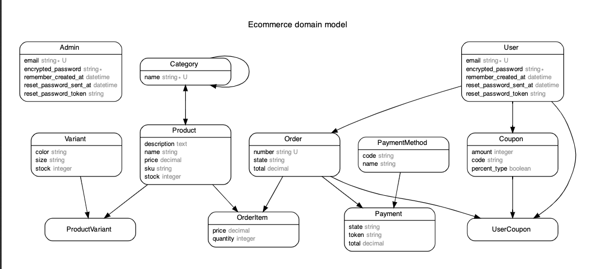

# README

- [x] Diagrama del modelo final.



- [x] Crear la o las relaciones y modelos para manejar los productos y sus variaciones. 
- [x]Crear la o las relaciones y modelos para manejar las tallas y colores de las variaciones.

*Para permitir las variaciones en talla y color de los productos crearemos el modelo  **variant** con los atributos size, color y stock. Además creamos el modelo **product_variant** que está relacionado al modelo **Product** y **Variant**. Luego de crear los modelos corremos la migración en la base de datos*

```ruby
rails g scaffold variant size color stock:integer
rails g scaffold product_variant product:references variant:references
rails db:migrate
```

*Modificamos los modelos para que incluyan las relaciones. Es neceario modificar el modelo **Product**, **Variant** y **Product_Variant***
```ruby
class Product < ApplicationRecord
  has_many :product_variants
  has_many :variants, through: :product_variants
```

```ruby
class Variant < ApplicationRecord
  has_many :product_variants
  has_many :products, through: :product_variants
```

```ruby
class ProductVariant < ApplicationRecord
  belongs_to :variant
  belongs_to :product
end
```

- [x] Implementar la solución para manejar distintos niveles de categorías y asegurarse que no tenga dos padres. También deberás implementar un test unitario para verificar este comportamiento.

*Para crear subcategorías vamos a hacer una relación de categorías sobre el mismo modelo. Para hacer esto crearemos la migración*

```ruby
rails g migration AddCategoryInCategories Category:references
```

*Revisamos la migración y la editamos*

```ruby
class AddCategoryInCategories < ActiveRecord::Migration[5.2]
  def change
    add_reference :categories, :parent, foreign_key: {to_table: :categories}
  end
end
```

*Luego es necesarion modificar el modelo **Category***

```ruby
class Category < ApplicationRecord
  has_and_belongs_to_many :products
  has_many :subcategories, class_name: "Category", foreign_key: "parent_id", dependent: :destroy
  belongs_to :parent, class_name: "Category", foreign_key: "parent_id", optional: true
```

*Creamos el test con rspec. Esto requiere de añadir la gema **rspec** en **development :test** de nuestro **Gemfile***

```ruby
group :development, :test do
  # Call 'byebug' anywhere in the code to stop execution and get a debugger console
  gem 'byebug', platforms: [:mri, :mingw, :x64_mingw]
  gem 'rspec-rails', '~> 4.0.2'
end
```

*Corremos bundle install, instalamos rspec y luego creamos el test para el modelo **Category**. En el terminal:*

```ruby
bundle install
rails g rspec:install
rails g rspec:model Category
```

*Modificamos **category_spec** con los siguientes test. En el caso del test para garantizar que cada Categoría tenga solo un padre,revisamos esto a través del tipo de dato del parent_id. Mientras este sea integer tenemos que el test se cumple. Esto considera que el padre puede ser modificado en el tiempo, esto facilita la recategorización de los productos.*

```ruby
require 'rails_helper'

RSpec.describe Category, type: :model do
  context "Category" do
    before(:all) do
      @parent = Category.create
      @child = @parent.subcategories.build
    end
    it "should equal subcategory" do
      expect(@parent.subcategories[0]).to eq(@child)
    end
    it "should reference to parent" do
      expect(@child.parent).to eq(@parent)
    end
    it "should have only one parent" do
      expect(@child.parent_id.integer?).to eq(true)
    end
  end
end
```

- [x] Generar un método o scope en las categorías, de tal forma que entregue una lista de cada categoría padre y otro de sus hijos, y los hijos de sus hijos, en todos los niveles.

*Para crear una lista de categorías padre creamos el siguiente método. El método crea un listado inicialmente vacío y le agrega el padre de la categoría actual a esta arreglo, para luego llamar al método sobre el padre de la actual categoría. Cuando el método no encuentra un padre para la categoría actual, retorna el arreglo con las categorías padres*

```ruby
  def parents(category = self)
    @parents_results ||= []
    return @parents_results if category.parent.nil?
    @parents_results << parent
    parents(category.parent)
  end
```

*De manera similar para crear un listado de hijos e hijos de los hijos se implementa el siguiente modelo. El método crea un arreglo con las subcategorias de las categorias y mientras existan subcategorías en este listado, tomaremos una de ellas (asignada a **current_node**) y la agregaremos al arreglo de subcategorías de la categoría actual. Para cada subcategoría se agregan al listado sus respectivas subcategorías en caso de existir. Finalmente el método retorna un listado de las subcategorías hijas de una categoría. *

```ruby
  def find_children(category = self.subcategories)
    current_children = subcategories.to_a
    children_to_return = []
    while current_children.present?
        current_node = current_children.shift
        children_to_return << current_node
        current_children.concat(current_node.subcategories)
    end
    children_to_return
  end
```

- [x] Las especificaciones para la lista de productos del catálogo son las siguientes: "Finalmente, nos indica que deben haber dos funcionalidades específicas: en el catálogo sólo se muestra un producto de cada tipo, esto es, si existe un modelo de zapatilla roja y otra negra, en el catálogo debe aparecer sólo una de ellas, esto implica que debe haber una página de descripción del producto en donde ahí podamos ver y elegir los colores y la talla, si una variación no tiene stock, no se puede comprar. Esto es importante, ya que si todas las variaciones no tienen stock, no debe aparecer en el catálogo principal."

*Para implementar este requerimiento según el modelo definido se debe hacer lo siguiente a la hora de querer mostrar los productos. Por ejemplo en el **home#index**, antes de mostrar los productos debemos verificar que exista stock de al menos una de sus variantes. Para esto se puede crear un método en el **home_helper.rb**. Por ejemplo: *

```ruby
def has_stock?(product)
  total_stock = 0
  Product.variants.each do |variant|
    total_stock += variant.stock
  end
  
  true unless total_stock == 0
end
```

*A partir de este método y su valor boolean, podemos discriminar que productos mostrar en el home*

*Luego en el **show** de un product, se pueden dar las opciones al usuario con lo siguiente.*

```ruby
<div class="field">
  <%= f.label :variant_id %>
  <%= f.collection_select(:variant_id, @product.variants, :id, :color)%>
</div>
```

*Solo se mostraran las opciones con stock gracias al scope definido el modelo **variant** *

```ruby
class Variant < ApplicationRecord
  has_many :product_variants
  has_many :products, through: :product_variants

  default_scope { where('stock > 0') }
end
```
- [x] Crear modelos para cupones
1.  Uno para distribuir en redes sociales (1 cupón lo pueden ocupar muchas personas).
2.  Otro para clientes específicos (1 cupón solo lo puede ocupar un cliente específico).

*Crearemos un modelo de cupon con los campos id, user_id (opcional), monto de descuento. El campo **percent_type** nos indica si el monto de descuento está en % o debe ser considerado como un monto total*

```ruby
rails g scaffold coupon user:references code:string amount:integer percent_type:boolean
```

*Modificaremos el modelo coupon para que el user_id sea opcional. De esta manera si queremos que el cupón sea único para un cliente, podemos asignarselo. En caso de ser para redes sociales, este no será asignado.*

```ruby
class Coupon < ApplicationRecord
  belongs_to :user, optional: true
end
```

*Agregamos la relación al modelo user*

```ruby
class User < ApplicationRecord
  devise :database_authenticatable, :registerable,
         :recoverable, :rememberable, :validatable
  has_many :orders
  has_many :coupons
end
```

*Crearemos una modelo que va a relacionar el uso de los cupones, el usuario comprador y la orden de compra*

```ruby
rails g model user_coupon user:references coupon:references order:references
rails db:migrate
```

*Agregamos las relaciones a los respectivos modelos. La relación de un cupón con un usuario será opcional, lo mismo en la relación user_coupons, ya que un cupón puede pertenecerle a un solo usuario y un usuario puede pagar una orden sin usar cupones*

```ruby
class Coupon < ApplicationRecord
  belongs_to :user, optional: true
  has_many :user_coupons, optional: true
  has_many :orders, through: :user_coupons
end

class User < ApplicationRecord
  devise :database_authenticatable, :registerable,
         :recoverable, :rememberable, :validatable
  has_many :coupons
  has_many :user_coupons
  has_many :orders, through: :user_coupons
end

class UserCoupon < ApplicationRecord
  belongs_to :user
  belongs_to :coupon, optional: true
  belongs_to :order
end

class Order < ApplicationRecord
  before_create -> { generate_number(hash_size) }

  has_one :user, through: :user_coupons
  has_one :coupon, through: :user_coupons
  has_one :user_coupons

```